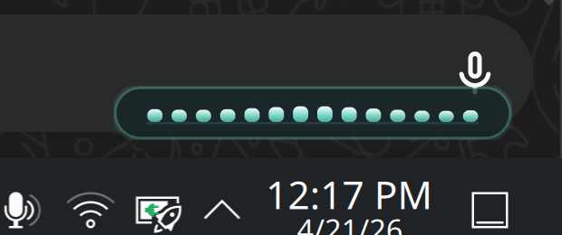

# KDE Listening Overlay

This directory contains the current known-good version of the KDE/Plasma Wayland listening overlay built around `voxtype`.

The overlay is a separate helper executable. It watches Voxtype's runtime state file and shows a slim equalizer-style HUD only while recording.

It is intended to feel visually polished without becoming heavy or intrusive, while staying as close as practical to upstream Voxtype by remaining a separate companion utility instead of a core patch.

## What It Is For

This overlay is meant for KDE Plasma users running Voxtype in toggle mode through KDE shortcuts.

It is designed to make the recording state more obvious without changing Voxtype core behavior:

- Voxtype keeps handling transcription
- KDE keeps handling the shortcut
- the overlay only reacts to Voxtype state changes



## Current Scope

This implementation is intentionally narrow:

- KDE Plasma on Wayland
- Qt6 Widgets plus LayerShellQt
- bottom-right panel placement assumptions
- user-level systemd session integration

## Current Behavior

- visible only while recording
- hidden while idle
- hidden while transcribing
- anchored above the Plasma bottom-right clock/date area
- stacked above normal windows
- non-interactive, so it does not steal focus from the active text field

## Important Dependency

The final reliable implementation depends on:

- Qt6 Widgets
- LayerShellQt

The `LayerShellQt` dependency is what made the final Wayland placement and focus behavior stable on KDE Plasma.

Do not simplify this back to a normal Qt floating window unless you are prepared to re-test placement and focus behavior on KDE Wayland.

## Files

- [`CMakeLists.txt`](CMakeLists.txt): build definition
- [`src/main.cpp`](src/main.cpp): overlay implementation
- [`IMPLEMENTATION_NOTES.md`](IMPLEMENTATION_NOTES.md): detailed engineering history
- [`examples/`](examples): sanitized launcher, config, and user-service examples from the tested setup

Notable example files:

- `examples/systemd/*.template`: cleaner publishable user-unit templates
- `examples/systemd/*.reference`: lightly sanitized copies of the tested-machine service units

## Build

From the repo root:

```bash
cmake -S extras/kde-listening-overlay -B build-overlay
cmake --build build-overlay -j4
```

## Basic Setup Flow

The expected setup looks like this:

1. Build the overlay helper.
2. Install `voxtype-listening-overlay` somewhere in your user `PATH`, such as `~/.local/bin/`.
3. Copy the sample config from `examples/config/voxtype-overlay.config.ini.sample` to `~/.config/voxtype-overlay/config.ini`.
4. Disable Voxtype's built-in hotkey and let KDE own the shortcut.
5. Use the user-service examples in `examples/systemd/` to start both Voxtype and the overlay in your session.

Or directly from this subdirectory:

```bash
cmake -S extras/kde-listening-overlay -B build-overlay
cmake --build build-overlay -j4
```

## Local Install Example

```bash
install -Dm0755 build-overlay/voxtype-listening-overlay ~/.local/bin/voxtype-listening-overlay
```

The example launchers and systemd files in [`examples/`](examples/) are intended as starting points. Adjust paths and service behavior to match your own install layout.

The engineering history, runtime assumptions, and remaining limitations are documented in [`IMPLEMENTATION_NOTES.md`](IMPLEMENTATION_NOTES.md).
